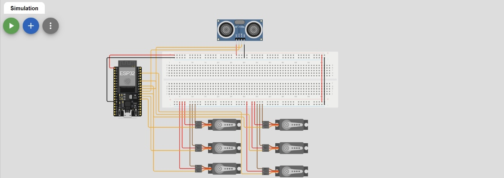
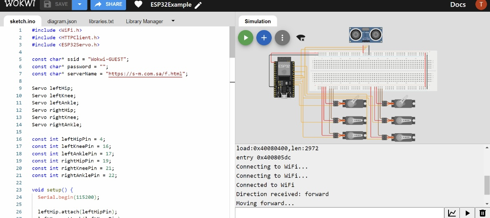

# Electronic Circuit with ESP32

## Description

This repository contains the design and programming details for an electronic circuit built with an ESP32, an HC-SR04 sensor, a breadboard, and six servo motors. The circuit is designed to control a bipedal robot with two legs, enabling it to move in five directions: left, right, stop, forward, and backward.

## Components Used

- **ESP32**: Microcontroller for controlling the circuit.
- **HC-SR04**: Ultrasonic sensor for distance measurement.
- **Breadboard**: Platform for assembling the circuit.
- **6 Servo Motors**: To control the robot's legs (3 per leg: pelvis, knee, and feet).
- **Wires**: For connecting components.

## Circuit Design

The circuit consists of an ESP32 connected to an HC-SR04 sensor and six servo motors. The servos are distributed as follows:
- **Pelvis Servo**: Controls the robot's hip movement.
- **Knee Servo**: Controls the robot's knee movement.
- **Feet Servo**: Controls the robot's foot movement.

### Connections

1. **HC-SR04 Sensor**:
   - VCC to ESP32 5V
   - GND to ESP32 GND
   - Trig to GPIO pin on ESP32
   - Echo to GPIO pin on ESP32

2. **Servos**:
   - Each servo's signal wire is connected to a GPIO pin on the ESP32.
   - Power and ground wires are connected to the breadboard's power rails.

## Programming

The ESP32 is programmed to control the servos based on input from the HC-SR04 sensor. The code includes functions to move the robot in the following directions:
- **Left**
- **Right**
- **Stop**
- **Forward**
- **Backward**

## Wokwi Circuit Link

You can view and interact with the circuit design on Wokwi using the following link:

[Wokwi Circuit Design]((https://wokwi.com/projects/403409215403308033))

## Photos

Here are images of the circuit:

Example of 'forward' direction :

